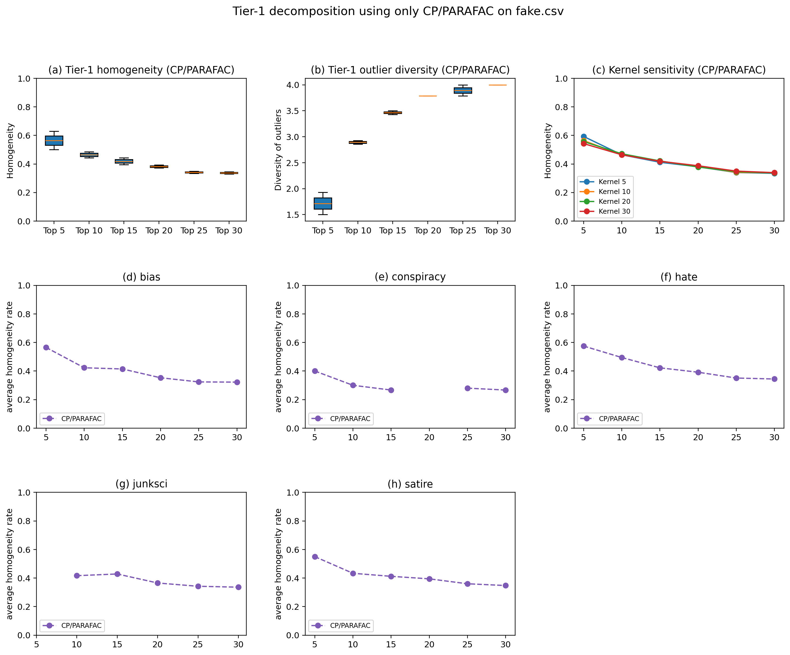
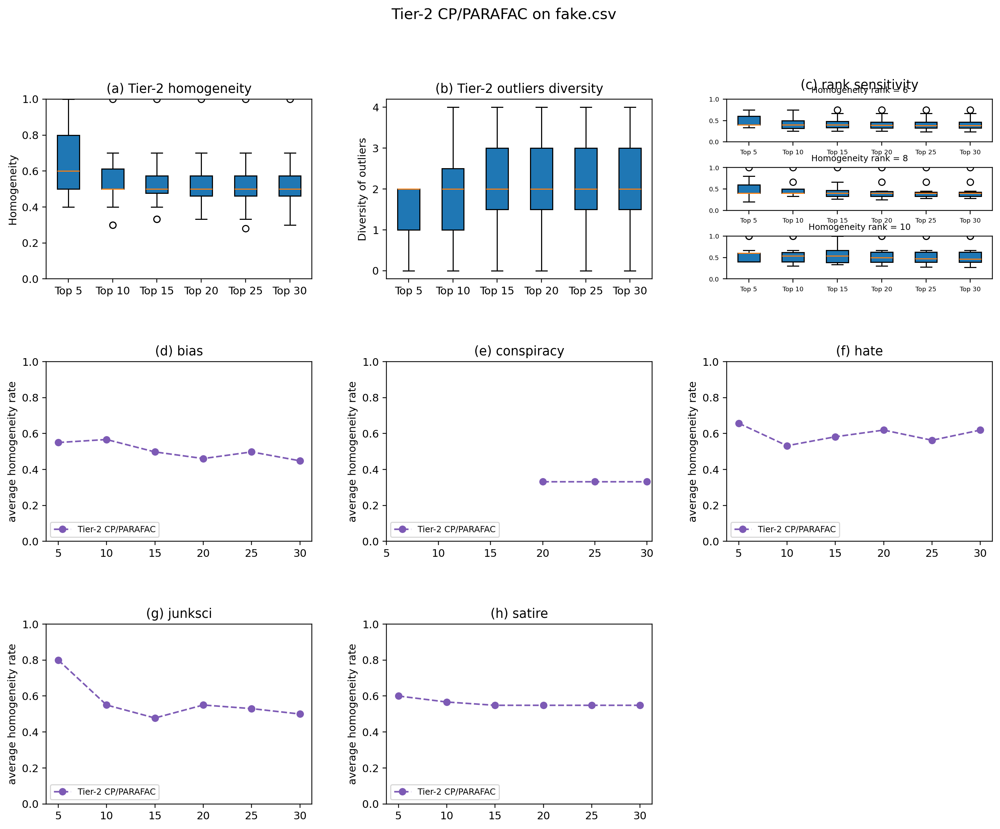
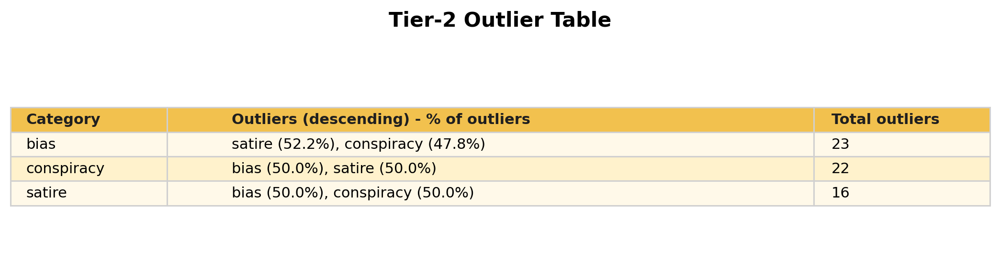

# Unsupervised Fake News Classification (Tensor Decomposition Ensembles)

## Study Replication

This repository recreates the two-tier workflow from the study on the available `fake.csv` corpus:

1. Tier-1: build document-level spatial tensors and apply CP/PARAFAC decomposition.
2. Tier-2: build an ensemble article-factor matrix and run co-clustering.

This is a replication implementation and not the original author codebase.

## Replicated Study Citation

- Title: Unsupervised Content-Based Identification of Fake News Articles with Tensor Decomposition Ensembles
- Authors: Seyedmehdi Hosseinimotlagh, Evangelos E. Papalexakis
- ResearchGate: https://www.researchgate.net/publication/323387293_Unsupervised_Content-Based_Identification_of_Fake_News_Articles_with_Tensor_Decomposition_Ensembles
- DOI: https://doi.org/10.48550/arXiv.1804.09088

## Dataset

Primary dataset file:

- `data/fake.csv`

Expected columns:

- `text`: article content
- `type`: category label
- `language`: language field used for filtering

Default filtering and balancing:

- exclude labels: `fake`, `bs`
- minimum preprocessed words: `100`
- per-class balancing target: `75` (or minimum available)

## Step-by-Step Methodology

### 1) Preprocess and balance corpus

1. Load articles from CSV.
2. Filter by language (`english` by default).
3. Normalize text, tokenize, remove stop words, apply stemming.
4. Keep documents with at least `min_words` tokens.
5. Exclude selected labels and balance class counts.

### 2) Tier-1: spatial relation extraction + CP/PARAFAC

1. Build a 3-way tensor `X` of shape `N x T x T`.
2. For each document slice, count term co-occurrence within a window `delta` (`--window-size`).
3. Run CP/PARAFAC on one or multiple rank configurations.
4. Compute Tier-1 metrics over top-k documents per factor:
	 - homogeneity
	 - outlier diversity
	 - category coverage

### 3) Tier-2: ensemble co-clustering

1. Collect document-factor memberships from multiple rank decompositions.
2. Partition factor memberships by ECDF percentiles (`90, 80, 65` by default).
3. Build the collective article-by-latent-factor matrix.
4. Apply co-clustering to obtain article groups.
5. Compute Tier-2 metrics:
	 - homogeneity
	 - outlier variety
	 - per-run summaries

### 4) Reporting and visualization

1. Save full experiment metrics and assignments.
2. Export Tier-1 and Tier-2 summary tables.
3. Generate figure recreations for Tier-1 and Tier-2 panels.

## Run Instructions

### 1) Install dependencies

```bash
pip install -r requirements.txt
```

### 2) Run the main replication pipeline

```bash
python run_experiment.py \
	--csv data/fake.csv \
	--max-docs 1500 \
	--min-words 100 \
	--window-size 10 \
	--rank-configs 6 8 10 \
	--decomposition cp_apr_kl \
	--ecdf-percentiles 90 80 65 \
	--n-coclusters 8 \
	--top-k-news 10 15 20 25 30 \
	--repeats 5
```

### 3) Generate Tier-1 figure (CP/PARAFAC)

```bash
python generate_tier1_cp_figure.py \
	--csv data/fake.csv \
	--max-docs 500 \
	--min-words 100 \
	--vocab-size 120 \
	--rank-configs 6 8 10 \
	--n-iter 12 \
	--repeats 2 \
	--top-k 5 10 15 20 25 30 \
	--kernel-sizes 5 10 20 30 \
	--output reports/tier1_cp_parafac_figure.png
```

### 4) Generate Tier-2 figure (CP/PARAFAC)

```bash
python generate_tier2_cp_figure.py \
	--csv data/fake.csv \
	--max-docs 500 \
	--min-words 100 \
	--vocab-size 120 \
	--window-size 10 \
	--rank-configs 6 8 10 \
	--ecdf-percentiles 90 80 65 \
	--n-coclusters 8 \
	--n-iter 12 \
	--repeats 2 \
	--top-k 5 10 15 20 25 30 \
	--output reports/tier2_cp_parafac_figure.png
```

### 5) Generate Tier-2 table and table figures

```bash
python generate_tier2_table.py \
	--assignments reports/cocluster_assignments.csv \
	--output-csv reports/tier2_outlier_table.csv \
	--output-md reports/tier2_outlier_table.md

python generate_tier2_table_figures.py \
	--input-csv reports/tier2_outlier_table.csv \
	--table-fig reports/tier2_outlier_table_figure.png \
	--bar-fig reports/tier2_outlier_stacked_bar.png
```

## Generated Outputs

Main outputs in `reports/`:

- `metrics.json`: full run metadata + Tier-1/Tier-2 results
- `study_config.json`: resolved experiment configuration
- `cocluster_assignments.csv`: document-to-co-cluster mapping
- `tier1_summary.csv`: Tier-1 summary by rank and top-k
- `tier2_runs.csv`: Tier-2 metrics per run
- `tier1_cp_parafac_figure.png`: Tier-1 recreation figure
- `tier2_cp_parafac_figure.png`: Tier-2 recreation figure
- `tier2_outlier_table.csv`: Tier-2 outlier table
- `tier2_outlier_table.md`: Markdown version of table
- `tier2_outlier_table_figure.png`: rendered table figure
- `tier2_outlier_stacked_bar.png`: outlier composition figure

### Results snapshot

Latest run details (from `reports/metrics.json`):

- Dataset after filtering/balancing: 114 documents
- Class distribution: satire 38, bias 38, conspiracy 38
- Tier-1 best observed homogeneity mean: 0.6000 (rank 8, top-k 15)
- Tier-2 homogeneity mean: 0.1825
- Tier-2 mean outlier variety: 2.0000

### Tier-1 figure (CP/PARAFAC)



### Tier-2 figure (CP/PARAFAC)



### Tier-2 outlier table (rendered)



